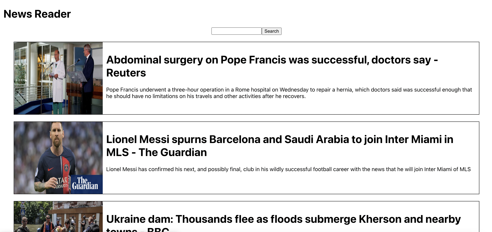
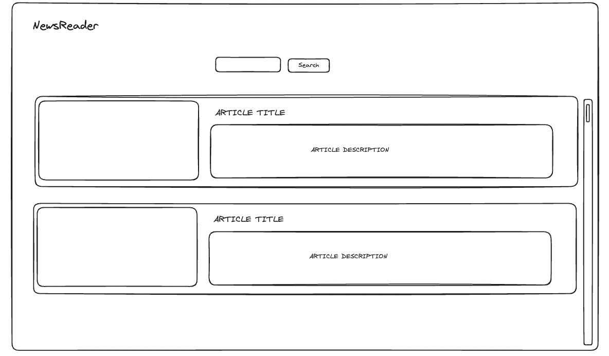
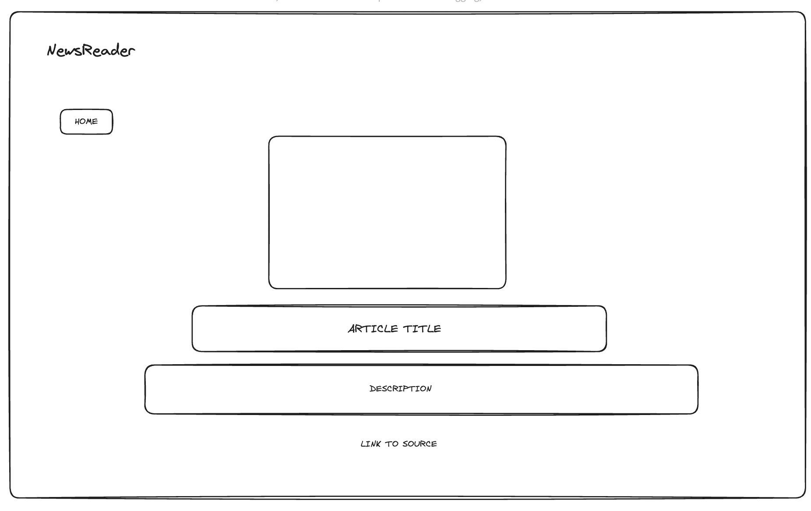

# News Reader

## Abstract:

News Reader provides users with the top US news headlines. Users can access a list of all articles, and select an article to access more information regarding the story. Users can read a brief description on the article and access a link to read the full story. It allows users to have a clear and concise archive of the most relevant news so they can briefly read over the headlines, or dive deeper into the biggest stories in the US.

## Context:

This application was created as a take-home challenge during the Mod 4 curriculum at the Turing School of Software and Design, and was meant to simulate a tech challenge in the job search process. It was completed in around 8 hours (1 hour for planning and the rest for coding) and presented as a requirement for graduation from the program.

## Technologies Used:
- React.js
- Router
- Postman

## API:

This application uses the News API to access data for the most recent US news headlines. Information about this API can be found [here](https://newsapi.org/).

## Installation:

To use this application ...
1. Fork and Clone this repo to your local machine
2. Run npm start in your terminal 

## Planning:

### MVP: 
1. User should be able to see a list of the top news headlines in the US when accessing the page
2. User should be able to click on one of the listed articles to see more information about that article
3. User should be able to click a link in the article details page to visit the source of the article
4. User should be able to search all the articles to find a specific article

### Wireframes:

